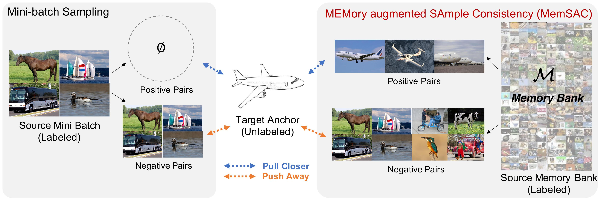

# MemSAC: ECCV 2022

We present MemSAC (Memory Augmented Sample Consistency for Large-Scale Domain Adaptation) for unsupervised domain adaptation across datasets with many categories or fine-grained classes. 



## The following dependencies are required.

- Ubuntu 18.04
- Python==3.7.4
- numpy==1.19.2
- PyTorch==1.4.0, torchvision==0.6.0, cudatoolkit==10.1

## Data

The datasets can be downloaded using the following links.

1. DomainNet: [http://ai.bu.edu/M3SDA/](http://ai.bu.edu/M3SDA/).
2. CUB-Paintings: [https://drive.google.com/file/d/1G327KsD93eyGTjMmByuVy9sk4tlEOyK3/view?usp=sharing](https://drive.google.com/file/d/1G327KsD93eyGTjMmByuVy9sk4tlEOyK3/view?usp=sharing) (from [https://github.com/thuml/PAN](https://github.com/thuml/PAN)).

Download the datasets into folder called `data/`.


## Training model on DomainNet

To train the model on DomainNet, run the following script.
```
bash jobs/domainNet_345.sh <source> <target> <Path for DomainNet dataset> <queue_size>
```

For example,
```
bash jobs/domainNet_345.sh real clipart ./data/DomainNet/ 48000
```

To train the model on CUB-Drawings, run the following script.
```
bash jobs/cub200.sh <source> <target> <Path for cub2011 dataset> <queue_size>
```

## Testing using trained model.

To directly test our trained model, download the models available at the following links.

 Method        | Trained Model  |
| ------------- |:-----|
| DomainNet | [Link](https://drive.google.com/drive/folders/1JpWG_Pdbt2G6PBAv7Ed-vWjB5Ct5-Qqp?usp=sharing) |
| CUB-200 |   [Link](https://drive.google.com/drive/folders/1akY4kZSz7ML5TkY15NhIDYKDttTXV-ye?usp=sharing)   |

##### CUB-200 dataset
```
python eval.py --nClasses 200 --checkpoint drawing_cub.pth.tar --data_dir <Path for cub2011 dataset> --batch_size 64 --dataset cub2011 --target cub
```

##### DomainNet
```
python eval.py --nClasses 345 --checkpoint real_clipart.pth.tar --data_dir <Path for domainNet dataset>  --dataset domainNet --target clipart
```

If you find MemSAC useful for your work please cite:
```
@article{kalluri2022memsac
  author    = {Kalluri, Tarun and Sharma, Astuti and Chandraker, Manmohan},
  title     = {MemSAC: Memory Augmented Sample Consistency for Large Scale Domain Adaptation},
  journal   = {ECCV},
  year      = {2022},
}
```
